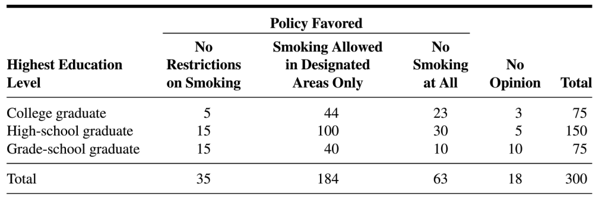

## Directions

**Please turn in this homework on Sakai.** Please submit your homework in pdf or html format. 

You can type your work on your computer or submit a photo of your written work or any other method that can be turned into a pdf. The Adobe Scan phone app is an easy way to scan photos and compile into a PDF. Please let me know if you greatly prefer to submit a physical copy. We can work out another way for you to turn in homework.

*You must show all of your work to receive credit.*

Extra problems do not need to be turned in!

## Questions

1.  From last homework: The following table shows the results of a survey in which the subjects were a sample of 300 adults residing in a certain metropolitan area. Each subject was asked to indicate which of three policies they favored with respect to smoking in public places. (Table is from *Biostatistics: A Foundation for Analysis in the Health Sciences*, 10th Edition, Daniel, Wayne W.; Cross, Chad L., pg. 630)

    {fig-align="center" width="6in"}

    Let $X=$ highest education level and $Y=$ policy favored. We can let $X=1$ for college graduate, $X=2$ for high-school graduate, etc., and similarly for $Y$, or just keep the category names for the different levels of $X$ and $Y$

    g.  Make a table for the conditional pmf $p_{X|Y}(x|y)$ and briefly describe in words what the values are the probability of.

    h.  Make a table for the conditional pmf $p_{Y|X}(y|x)$ and briefly describe in words what the values are the probability of.
    
2.  Each day, Maude has a 1% chance of losing her cell phone (her behavior on different days is independent). Each day, Maude has a 3% chance of forgetting to eat breakfast (again, her behavior on different days is independent). Her breakfast and cell phone habits are independent. Let $X$ be the number of days until she first loses her cell phone. Let $Y$ be the number of days until she first forgets to eat breakfast. (Here, $X$ and $Y$ are independent.)

    a.  Find the joint probability mass function of $X$ and $Y$.

    b.  Find the joint cdf of $X$ and $Y$ and briefly explain what $F_{X,Y}(x,y)$ represents in the context of the problem.

    c.  Find the conditional pmf $p_{Y|X}(y|x)$.
