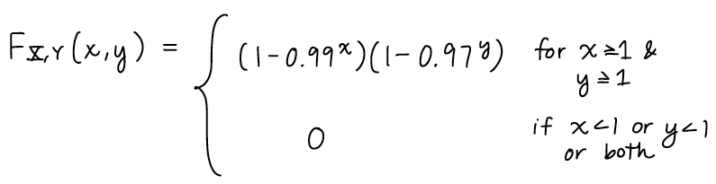
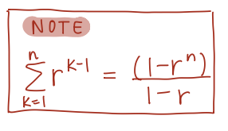

## Questions

1. Partial answers:

 - (g) $p_{X|Y}(X=\text{high school}| Y=\text{no smoking at all}) = 0.476$

 - (h) $p_{Y|X}( Y=\text{no smoking at all}|X=\text{high school}) = 0.200$

2. 
    
    - (a) $p_{X,Y}(x,y) = [0.99^{x-1}0.01][0.97^{y-1}0.03]$ for $x,y = 0, 1, 2, ...$
    - (b)  And hint: 
        
    - (c) 
    
3. $f_Z(z) = nF_X(z)^{n-1}f_X(z)$

4.

  - (b) $P(X<Y) = 0.099995$
  - (d) $f_Z(z) = \dfrac{11-2z}{5}e^{-2z}$ for $0 \leq z \leq 5$
        
5. 2 cases: when $0< z < 1$ and $1 \leq z \leq 2$