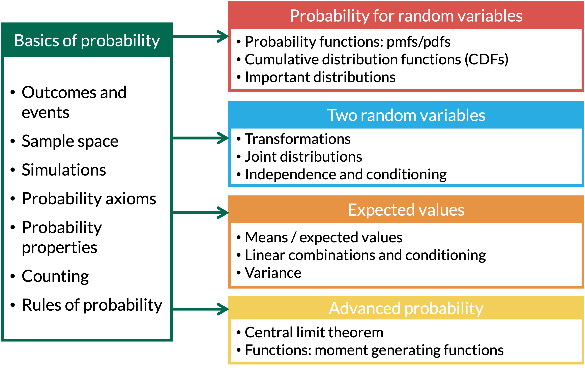

```{r setup, include=FALSE}
library(here)
source(here("class_dates.R"))

library(tidyverse)
```

## Learning Objectives

1.  Calculate probabilities for a pair of discrete random variables

2.  Calculate a *joint, marginal, and conditional* probability mass function (pmf)

3.  Calculate a *joint, marginal, and conditional* cumulative distribution function (CDF)

## Where are we?

{fig-align="center"}

## What is a joint pmf?

::: definition
::: def-title
Definition: joint pmf
:::

::: def-cont
The **joint pmf** of a pair of discrete r.v.'s $X$ and $Y$ is $$p_{X,Y}(x,y) = \mathbb{P}(X=x\ and\ Y=y) = \mathbb{P}(X=x, Y=y)$$
:::
:::

## This chapter's main example

::: columns
::: {.column width="100%"}
::: example
::: ex-title
Example 1
:::

::: ex-cont
Let $X$ and $Y$ be two random draws from a box containing balls labelled 1, 2, and 3 without replacement.

1.  Find $p_{X,Y}(x,y)$.

2.  Find $\mathbb{P}(X+Y=3).$

3.  Find $\mathbb{P}(Y = 1).$

4.  Find $\mathbb{P}(Y \leq 2).$

5.  Find the joint CDF $F_{X,Y}(x,y)$ for the joint pmf $p_{X,Y}(x,y)$

6.  Find the marginal CDFs $F_{X}(x)$ and $F_{Y}(y)$

7.  Find $p_{X|Y}(x|y)$.

8.  Are $X$ and $Y$ independent? Why or why not?
:::
:::
:::
:::

## Joint pmf

::: columns
::: {.column width="35%"}
::: example
::: ex-title
Example 1
:::

::: ex-cont
Let $X$ and $Y$ be two random draws from a box containing balls labelled 1, 2, and 3 without replacement.

1.  Find $p_{X,Y}(x,y)$.

2.  Find $\mathbb{P}(X+Y=3).$
:::
:::
:::
:::

## Marginal pmf's

::: columns
::: {.column width="35%"}
::: example
::: ex-title
Example 1
:::

::: ex-cont
Let $X$ and $Y$ be two random draws from a box containing balls labelled 1, 2, and 3 without replacement.

3.  Find $\mathbb{P}(Y = 1).$

4.  Find $\mathbb{P}(Y \leq 2).$
:::
:::
:::
:::

## Remarks on the joint pmf

Some properties of joint pmf's:

-   A joint pmf $p_{X,Y}(x,y)$ must satisfy the following properties:

    -   $p_{X,Y}(x,y)\geq 0$ for all $x, y$.

    -   $\sum \limits_{\{all\ x\}} \sum \limits_{\{all\ y\}} p_{X,Y}(x,y)=1$.

-   Marginal pmf's:

    -   $p_X(x) = \sum \limits_{\{all\ y\}} p_{X,Y}(x,y)$

    -   $p_Y(y) = \sum \limits_{\{all\ x\}} p_{X,Y}(x,y)$

## What is a joint CDF?

::: definition
::: def-title
Definition: joint CDF
:::

::: def-cont
The **joint CDF** of a pair of discrete r.v.'s $X$ and $Y$ is $$F_{X,Y}(x,y) = \mathbb{P}(X \leq x\ and\ Y \leq y) = \mathbb{P}(X \leq x, Y \leq y)$$
:::
:::

## Joint CDFs

::: columns
::: {.column width="35%"}
::: example
::: ex-title
Example 1
:::

::: ex-cont
Let $X$ and $Y$ be two random draws from a box containing balls labelled 1, 2, and 3 without replacement.

5.  Find the joint CDF $F_{X,Y}(x,y)$ for the joint pmf $p_{X,Y}(x,y)$
:::
:::
:::
:::

## Marginal CDFs

::: columns
::: {.column width="35%"}
::: example
::: ex-title
Example 1
:::

::: ex-cont
Let $X$ and $Y$ be two random draws from a box containing balls labelled 1, 2, and 3 without replacement.

6.  Find the marginal CDFs $F_{X}(x)$ and $F_{Y}(y)$
:::
:::
:::
:::

## Remarks on the joint and marginal CDF

-   $F_X(x)$: right most columns of the CDf table (where the $Y$ values are largest)

-   $F_Y(y)$: bottom row of the table (where X values are largest)

-   $F_X(x)=\lim\limits_{y\rightarrow\infty}F_{X, Y}(x,y)$

-   $F_Y(y)=\lim\limits_{x\rightarrow\infty}F_{X, Y}(x,y)$

## Independence and Conditioning

Recall that for *events* $A$ and $B$,

-   $\mathbb{P}(A|B) = \frac{\mathbb{P}(A \cap B)}{\mathbb{P}(B)}$

-   $A$ and $B$ are independent if and only if

    -   $\mathbb{P}(A|B) = \mathbb{P}(A)$

    -   $\mathbb{P}(A \cap B) = \mathbb{P}(A)\cdot\mathbb{P}(B)$

Independence and conditioning are defined similarly for r.v.'s, since $$p_X(x) = \mathbb{P}(X=x)\ \mathrm{and}\ \ p_{X,Y}(x,y) = \mathbb{P}(X = x ,Y = y).$$

## What is the conditional pmf?

::: definition
::: def-title
Definition: conditional pmf
:::

::: def-cont
The **conditional pmf** of a pair of discrete r.v.'s $X$ and $Y$ is defined as $$p_{X|Y}(x|y) = \mathbb{P}(X = x |Y = y) = \frac{\mathbb{P}(X = x\ and\ Y = y)}{\mathbb{P}(Y = y)}
=\frac{p_{X,Y}(x,y) }{p_{Y}(y) }$$ if $p_{Y}(y) > 0$.
:::
:::

## Remarks on the conditional pmf

The following properties follow from the conditional pmf definition:

-   If $X \perp Y$ (independent)

    -   $p_{X|Y}(x|y) = p_X(x)$ for all $x$ and $y$
    -   $p_{X,Y}(x,y) = p_X(x)p_Y(y)$ for all $x$ and $y$
    -   Which also implies ($\Rightarrow$): $F_{X,Y}(x,y) = F_X(x)F_Y(y)$ for all $x$ and $y$

-   If $X_1, X_2, …, X_n$ are independent

    -   $$p_{X_1, X_2, …, X_n}(x_1, x_2, …, x_n) = P(X_1=x_1, X_2=x_2, …, X_n=x_n)=\prod\limits_{i=1}^np_{X_i}(x_i)$$
    -   $$F_{X_1, X_2, …, X_n}(x_1, x_2, …, x_n) = P(X_1\leq x_1, X_2\leq x_2, …, X_n\leq x_n)=\prod\limits_{i=1}^nP(X_i \leq x_i) = \prod\limits_{i=1}^nF_{X_i}(x_i)$$

## Conditional pmf's

::: columns
::: {.column width="35%"}
::: example
::: ex-title
Example 1
:::

::: ex-cont
Let $X$ and $Y$ be two random draws from a box containing balls labelled 1, 2, and 3 without replacement.

7.  Find $p_{X|Y}(x|y)$.
8.  Are $X$ and $Y$ independent? Why or why not?
:::
:::


::: example
::: ex-cont
<font size=6ex>Remark:

-   To show that $X$ and $Y$ are *not* independent, we just need to find one counter example
-   However, to show that they *are* independent, we need to verify this for all possible pairs of $x$ and $y$ 

</font>
:::
:::
:::
:::

## Hypothetical 4-sided die {visibility="hidden"}

::: example
::: ex-title
Example 3
:::

::: ex-cont
-   Suppose you have a 4-sided die, and you roll the 4-sided die until the first 4 appears.

-   Let $X$ be the number of rolls required until (and including) the first 4.

-   After the first 4, you keep rolling it again until you roll a 3.

-   Let $Y$ be the number of rolls, after the first 4, required until (and including) the 3.

1.  Find $p_{X,Y}(x,y)$.

2.  Using $p_{X,Y}(x,y)$, find $p_{Y}(y)$.

3.  Find $p_{X}(x)$.

4.  Are $X$ and $Y$ are independent? Why or why not?

5.  Find $F_{X,Y}(x,y)$.
:::
:::


## Learning Objectives

1.  Solve double integrals in our mini lesson!

2.  Calculate probabilities for a pair of continuous random variables

3.  Calculate a *joint and marginal* probability density function (pdf)

4.  Calculate a *joint and marginal* cumulative distribution function (CDF) from a pdf

## Double Integrals Mini Lesson (1/3)

::: {.callout-important appearance="simple" icon="false"}
Do this problem at home for extra practice. I'll add the solution to the annotated notes!
:::

::: columns
::: {.column width="30%"}
::: example
::: ex-title
Mini Lesson Example 1
:::

::: ex-cont
Solve the following integral: $\displaystyle\int_{2}^{3}\displaystyle\int_{0}^{1} xy dydx$
:::
:::
:::
:::

## Double Integrals Mini Lesson (2/3)

::: {.callout-important appearance="simple" icon="false"}
Do this problem at home for extra practice. I'll add the solution to the annotated notes!
:::

::: columns
::: {.column width="30%"}
::: example
::: ex-title
Mini Lesson Example 2
:::

::: ex-cont
Solve the following integral: $\displaystyle\int_{2}^{3}\displaystyle\int_{0}^{1} (x+y) dydx$
:::
:::
:::
:::

## Double Integrals Mini Lesson (3/3)

::: {.callout-important appearance="simple" icon="false"}
Do this problem at home for extra practice. I'll add the solution to the annotated notes!
:::

::: columns
::: {.column width="30%"}
::: example
::: ex-title
Mini Lesson Example 3
:::

::: ex-cont
Solve the following integral: $\displaystyle\int_{2}^{3}\displaystyle\int_{0}^{1} e^{x+y} dydx$
:::
:::
:::
:::

## How to define the joint pdf for continuous RVs?

::: columns
::: {.column width="37%"}

For a single continuous RV $X$ is a function $f_X(x)$, such that for all real values $a,b$ with $a \leq b$, $$\mathbb{P}(a \leq X \leq b) = \int_a^b f_X(x)dx$$

:::

::: {.column width="62%"}

For two continuous RVs ($X$ and $Y$), we can define the **joint pdf**, $f_{X,Y}(x,y)$, such that for all real values $a,b, c, d$ with $a \leq b$ and $c \leq d$, $$\mathbb{P}(a \leq X \leq b, c \leq Y \leq d) = \int_a^b \int_c^d f_{X,Y}(x,y)dydx$$

:::


:::

## Important properties of the joint pdf

1.  Note that $f_{X,Y}(x,y)\neq \mathbb{P}(X=x, Y=y)$!!!

2.  In order for $f_{X,Y}(x,y)$ to be a pdf, it needs to satisfy the properties

    -   $f_{X,Y}(x,y)\geq 0$ for all $x,y$

    -   $\displaystyle\int_{-\infty}^{\infty}\displaystyle\int_{-\infty}^{\infty} f_{X,Y}(x,y)dxdy=1$

## What is the joint cumulative distribution function?

::: definition
::: def-title
Definition: Joint cumulative distribution function (Joint CDF)
:::

::: def-cont
The **joint cumulative distribution function (cdf)** of continuous random variables $X$ and $Y$, is the function $F_{X,Y}(x,y)$, such that for all real values of $x$ and $y$, $$F_{X,Y}(x,y)= \mathbb{P}(X \leq x, Y \leq y) = \int_{-\infty}^x\int_{-\infty}^y f_{X,Y}(s,t)dtds$$
:::
:::

**Remarks:**

-   The definition above for $F_{X,Y}(x,y)$ is a **function** of $x$ and $y$.

-   The joint cdf at the point $(a,b)$, is $$F_{X,Y}(a,b) = \mathbb{P}(X \leq a, Y \leq b) = \int_{-\infty}^a\int_{-\infty}^b f_{X,Y}(s,t)dtds$$

## What are the marginal pdf's?

::: definition
::: def-title
Definition: Marginal pdf's
:::

::: def-cont
Suppose $X$ and $Y$ are continuous r.v.'s, with joint pdf $f_{X,Y}(x,y)$. Then the **marginal probability density functions** are $$\begin{aligned}
f_X(x)&=& \int_{-\infty}^{\infty} f_{X,Y}(x,y)dy\\
f_Y(y)&=& \int_{-\infty}^{\infty} f_{X,Y}(x,y)dx
\end{aligned}$$
:::
:::

## Common steps for solving problems

1. Set up the domain of the pdf with a picture

2. Translate to needed integrands

    - For probability: shade in the area of interest, then translate
    - For expected value: translate domain

3. Set up integral: $dxdy$ or $dydx$?

4. Solve integral!

## Example of joint pdf

::: columns
::: {.column width="30%"}
::: example
::: ex-title
Example 1.1
:::

::: ex-cont
Let $f_{X,Y}(x,y)= \frac32 y^2$, for $0 \leq x \leq 2, \ 0 \leq y \leq 1$.

1.  Find $\mathbb{P}(0 \leq X \leq 1, 0 \leq Y \leq \frac12)$.
:::
:::
:::
:::

## Example of joint pdf

::: columns
::: {.column width="30%"}
::: example
::: ex-title
Example 1.2
:::

::: ex-cont
Let $f_{X,Y}(x,y)= \frac32 y^2$, for $0 \leq x \leq 2, \ 0 \leq y \leq 1$.

2.  Find $f_X(x)$ and $f_Y(y)$.
:::
:::
:::
:::

## Example of a *more complicated* joint pdf

::: {.callout-important appearance="simple" icon="false"}
Do this problem at home for extra practice. I'll add the solution to the annotated notes!
:::

::: columns
::: {.column width="30%"}
::: example
::: ex-title
Example 2.1
:::

::: ex-cont
Let $f_{X,Y}(x,y)= 2 e^{-(x+y)}$, for $0 \leq x \leq y$.

1.  Find $f_X(x)$ and $f_Y(y)$.
:::
:::
:::
:::

## Example of a *more complicated* joint pdf

::: {.callout-important appearance="simple" icon="false"}
Do this problem at home for extra practice. I'll add the solution to the annotated notes!
:::

::: columns
::: {.column width="30%"}
::: example
::: ex-title
Example 2.2
:::

::: ex-cont
Let $f_{X,Y}(x,y)= 2 e^{-(x+y)}$, for $0 \leq x \leq y$.

2.  Find $\mathbb{P}(Y < 3)$.
:::
:::
:::
:::

## Let's complicate this even more!

::: columns
::: {.column width="30%"}
::: example
::: ex-title
Example 3.1
:::

::: ex-cont
Let $X$ and $Y$ have constant density on the square $0 \leq X \leq 4, 0 \leq Y \leq 4$.

1.  Find $\mathbb{P}(|X-Y| < 2)$
:::
:::
:::
:::

## Finding the pdf of a transformation

- Let $M$ be a transformation of $X$ and $Y$

- When we have a transformation of $X$ and $Y$, $M$, we need to follow a specific process to find the pdf of $M$

We follow this process:

1. Start with the joint pdf for $X$ and $Y$ 

    - aka $f_{X,Y}(x, y)$

2. Translate the domain of $X$ and $Y$ to $M$

3. Find the CDF of $M$ 

    - aka $F_M(m)$ or $P(M \leq m)$

4. Take the derivative of the CDF of $M$ to find the pdf of $M$ 

    - aka $f_M(m) = \dfrac{d}{dm}F_M(m)$


## Let's complicate this even more!

::: columns
::: {.column width="30%"}
::: example
::: ex-title
Example 3.2
:::

::: ex-cont
Let $X$ and $Y$ have constant density on the square $0 \leq X \leq 4, 0 \leq Y \leq 4$.

2.  Let $M = \max(X,Y)$. Find the pdf for $M$, that is $f_M(m)$.
:::
:::
:::
:::

## Let's complicate this even more!

::: {.callout-important appearance="simple" icon="false"}
Do this problem at home for extra practice. I'll add the solution to the annotated notes!
:::

::: columns
::: {.column width="30%"}
::: example
::: ex-title
Example 3.3
:::

::: ex-cont
Let $X$ and $Y$ have constant density on the square $0 \leq X \leq 4, 0 \leq Y \leq 4$.

3.  Let $Z = \min(X,Y)$. Find the pdf for $Z$, that is $f_Z(z)$.
:::
:::
:::
:::

## Let's complicate this even further!

::: {.callout-important appearance="simple" icon="false"}
Do this problem at home for extra practice. I'll add the solution to the annotated notes!
:::

::: columns
::: {.column width="30%"}
::: example
::: ex-title
Example 4
:::

::: ex-cont
Let $X$ and $Y$ have joint density $f_{X,Y}(x,y)= \frac85(x+y)$ in the region $0 < x < 1,\ \frac12 < y <1$. Find the pdf of the r.v. $Z$, where $Z=XY$.
:::
:::
:::
:::
